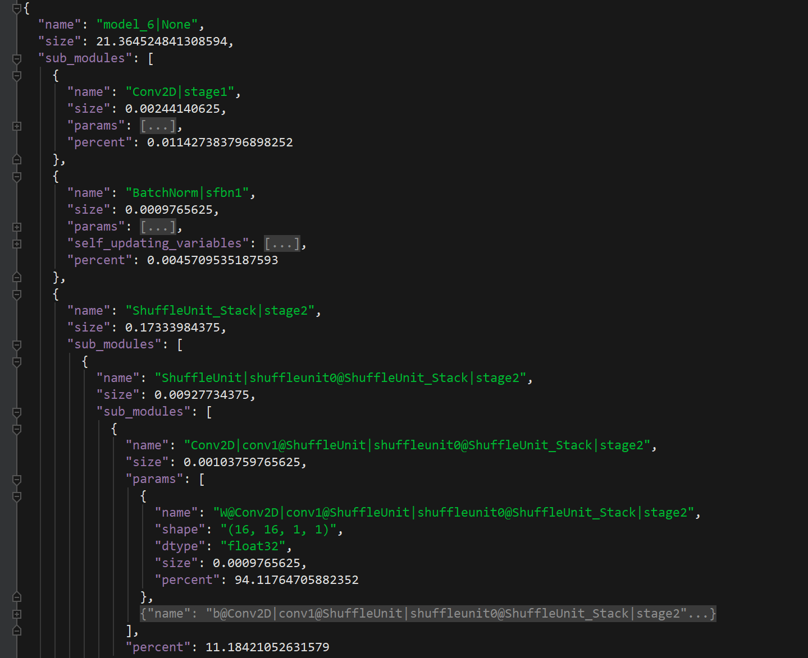

**Model Summary and Visualization Toolkits**
_______________________________________________________________________


## get_model_size
Calculate model parameter size, return result in bytes.
```python
get_model_size(model)
```
* **model**: model defined by Dandelion

_______________________________________________________________________
## get_model_summary
Produce model parameter summary.
```python
get_model_summary(model, size_unit='M')
```
* **model**: model defined by Dandelion
* **size_unit**: {*'M'*|'K'|'B'|int}, unit for calculating parameter size.
* **return**: `OrderedDict` instance. You can use `json.dumps()` to get a formatted json report file. For example:

```python
    import json
    from dandelion.model import Alternate_2D_LSTM
    input_dim, hidden_dim, B, H, W = 8, 8, 2, 32, 32
    model = Alternate_2D_LSTM(input_dims=[input_dim],hidden_dim=hidden_dim, peephole=True, mode=2)
    model_summary = get_model_summary(model, size_unit=1)
    rpt = json.dumps(model_summary, ensure_ascii=False, indent=2)
    print(rpt)
```
The following is a snapshot of a complex model's summary, in which :

* the `size` attribute is in `MB` unit.
* the `percent` attribute is level-wise, and already in [0 ~ 100] range.

For example in the snapshot, it says *model_6* (weights) is 21.36MB in total, and the first convolution layer *stage1* accounts for 0.011% of all the weights.

