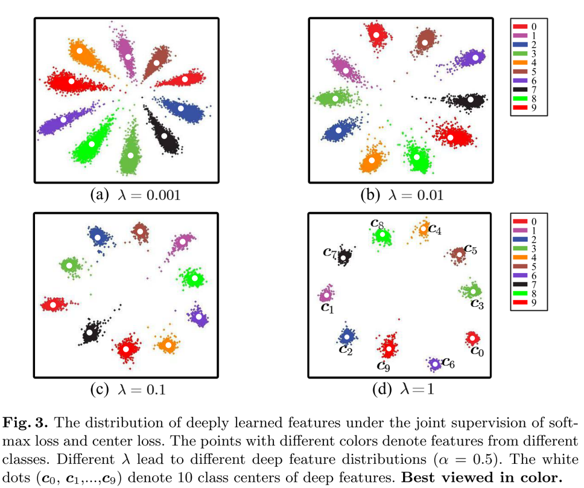

# Tutorial II: Write Your Own Module

In this tutorial, you’ll learn how to write your own neural network module with the help of Dandelion. Here we’ll design a module which gives the class centers for classification output. It’s a simple case for Dandelion yet not so intuitive for Lasagne or Keras users.

In image classification tasks, such as face recognition, document image classification, Imagenet contests, etc., we usually consider only the “positive” samples, i.e., we assume that given any input sample, it would be associated with at least one out of all the known class labels. However, in actual applications, we often also want the trained neural network model to be able to tell whether an input sample is an “outsider” or not.

To accomplish this task, we can add an extra “negative” class to the final layer of the network, and then train this augmented network by feeding it with all kinds of “negative” samples you can collect. It’s pure data-driven, so the bottleneck is how many “negative” samples can be collected. 

Another way is algorithm-driven: we design a new network module to explore the intrinsic properties of the data, and use these “properties” to reject or accept an sample as “positive”. By this way we do not need to collect negative samples, and the model is more general and the most important: explainable.

The data intrinsic property to explore here is the class center for each positive class. The intuition is that if we can get the center of each class, then we can use the sample-center distance to reject or accept an sample as “positive”. 

Now assume that the last layer of the neural network is a `Dense` module followed by a `softmax` activation which produces `N` class decisions. We’ll refer the input of this `Dense` module as feature of the input sample (extracted by the former part of the whole neural network). For plain network trained with only positive samples, the feature distribution can be typically visualized as


* *A Discriminative Deep Feature Learning Approach for Face Recognitions*. Yandong Wen, Kaipeng Zhang, Zhifeng Li and Yu Qiao. European Conference on Computer Vision (ECCV) 2016

## Center Loss

Apparently the feature extracted by the plain model is not well centered, in other words, the feature distribution is not well-formed.

Ideally, to reject or accept one sample as a certain class, we can set a probability threshold so that any sample whose feature satisfies
𝑝(𝑓_𝑗│𝐶_𝑖)<𝑇_𝑖 will be rejected as an “outsider” for this class with certainty 1−𝑇_𝑖

But before we can do this, the distribution 𝑝(𝑓│𝐶_𝑖) must be known. To get this conditional distribution, we can either traverse all the train samples and use any probability estimation / modelling method to approximate the true distribution, or we can resort to the DL method by directly requiring the neural network to produce features satisfying predefined distributions.

The reason we can do this is because a neural network can be trained to emulate any nonlinear functions, and we can always transform a compact distribution into Gaussian by a certain function. 

To restrain the neural network to extract Gaussian distributed features, we assume each class has a mean feature vector (i.e., center) 𝑓_𝜇𝑖 and require the model to minimize the distance between extracted feature and its corresponding center vector, i.e., 

min⁡‖𝑓_𝑗−𝑓_𝜇𝑖 ‖^2  𝑖𝑓 𝑠𝑎𝑚𝑝𝑙𝑒 𝑗 𝑏𝑒𝑙𝑜𝑛𝑔𝑠 𝑡𝑜 𝑐𝑙𝑎𝑠𝑠 𝑖

We refer this objective as “center loss”, the details can be found in Ref. [A Discriminative Deep Feature Learning Approach for Face Recognition. Yandong Wen, Kaipeng Zhang, Zhifeng Li and Yu Qiao. European Conference on Computer Vision (ECCV) 2016]. The model is trained now with both the categorical cross entropy loss and the center loss as 

min⁡ 𝐶𝑎𝑡𝑒𝑔𝑜𝑟𝑖𝑐𝑎𝑙𝐶𝑟𝑜𝑠𝑠𝐸𝑛𝑡𝑟𝑜𝑝𝑦+𝜆∗𝐶𝑒𝑛𝑡𝑒𝑟𝐿𝑜𝑠𝑠  



## `Center` Module
Now we’ll go through the code part to illustrate how the center loss can be actually computed. To compute the center loss, we need first to get the center estimation of each class. This is done through a new module referred as `Center`. Check the code snippet following.

```python
class Center(Module):
    """
    Compute the class centers during training
    Ref. to "Discriminative feature learning approach for deep face recognition (2016)"
    """
    def __init__(self, feature_dim, center_num, alpha=0.9, center=init.GlorotUniform(), name=None):
        """
        :param alpha: moving averaging coefficient
        :param center: initial value of center
        """
        super().__init__(name=name)
        self.center = self.register_self_updating_variable(center, shape=[center_num, feature_dim], name="center")
        self.alpha = alpha

    def forward(self, features, labels):
        """
        :param features: (B, D)
        :param labels: (B,)
        :return: categorical centers
        """
        center_batch = self.center[labels, :]
        diff = (self.alpha - 1.0) * (center_batch - features)
        center_updated = tensor.inc_subtensor(self.center[labels, :], diff)
        self.center.default_update = center_updated
        return self.center

    def predict(self):
        return self.center

```

First, all our NN modules should subclass the root `Module` class, then we can use class methods and attributes to manipulate network parameters conveniently.

Second, define the module initialization in `.__init__()` part. Here we do two things: we register a `center` tensor as network parameter and initialize it with a Glorot uniform random numpy array. The `center` tensor is of shape `(center_num, feature_dim)`, in which `center_num` should be equal to class number, and `feature_dim` is the dimension of extracted features by the network.

In Dandelion, the network parameters are divided into two categories:  

* 1) parameter to be updated by optimizer,  
* 2) parameter to updated by user defined expression.

The former parameters should be registered with class method `.register_param()`, and the latter parameters should be registered with class method `. register_self_updating_variable()`.

Now we registered `center` tensor as self updating variable, its updating expression is given in `.forward()` function as `self.center.update = center_updated`. In Dandelion we use a specially named attribute `. update` to tell the framework that this parameter has an updating expression defined and the updating expression will be collected during Theano function compiling phase.

The `.forward()` function will be used for training, and `.predict()` function will be used for inference. 

Basically, during training, the `.forward()` function computes moving averaging estimation of class centers; and during inference, we just use the stored center values as final estimated class centers. This is pretty much alike how `BatchNorm`’s mean and std are estimated and used.

## Summary

To summary, to write your own module, you only need to do the following three steps:

* 1) subclass `Module` class
* 2) register your module’s parameters by `.register_param()` or `. register_self_updating_variable()` and initialize them
* 3) define the `.forward()` function for training and `.predict()` function for inference

and that’s it! 
